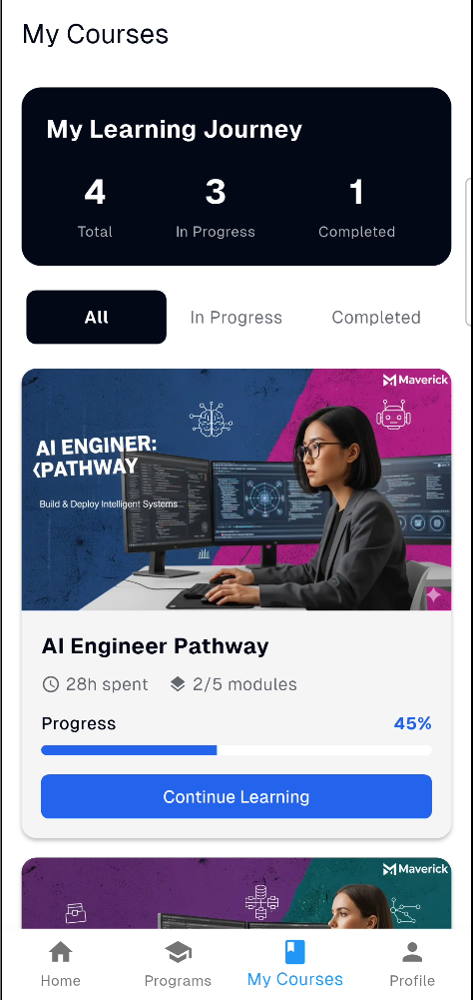

# Maverick

A modern learning platform for students, built with Flutter.

## Vision

Maverick aims to empower learners by providing access to a wide range of courses and programs in an engaging, intuitive, and mobile-first experience. The platform is designed to help users discover, enroll in, and track progress across diverse learning opportunities.

## Objectives

- Deliver a seamless and beautiful learning experience on mobile and web using Flutter.
- Enable users to browse, enroll in, and complete courses and programs.
- Provide personalized recommendations and progress tracking.
- Ensure easy navigation and a user-friendly interface.

## Navigation Flow

Maverick features a simple, intuitive navigation structure with five main screens:

1. **Login Screen**
   - The entry point for all users. Secure authentication ensures only authorized access.
   - After successful login, users are redirected to the Home screen.

2. **Home Screen**
   - Displays a list of new and recommended courses.
   - Shows the user's current progress in enrolled courses.
   - Features a bottom navigation bar for quick access to other sections.

3. **Programs Screen**
   - Accessed via the bottom navigation bar.
   - Lists all available programs with brief details for each.
   - Users can browse and select programs to learn more.

4. **Program Detail Screen**
   - Shows comprehensive details about a selected program.
   - Allows users to enroll in the program.
   - Displays the full list of course contents within the program.

5. **Profile Screen**
   - Accessed via the bottom navigation bar.
   - Displays user information and profile details.

## Bottom Navigation Bar

The bottom navigation bar is visible on main screens and includes:
- **Home:** Returns to the Home screen.
- **Programs:** Opens the Programs listing page.
- **My Courses:** Shows the user's enrolled courses and progress.
- **Profile:** Opens the Profile screen.

## Screenshots

Below are screenshots of Maverick in action:

<table>
  <tr>
    <td></td>
    <td></td>
    <td></td>
  </tr>
  <tr>
    <td></td>
    <td></td>
    <td></td>
  </tr>
</table>

## Screen Recording

https://github.com/Esfokom/Maverick/raw/main/public/screenrecordings/Maverick.mp4

  
Click to view embedded video

  <video src="public/screenrecordings/Maverick.mp4" controls width="600"></video>

## Summary

Maverick is a comprehensive platform where learners can discover, enroll in, and track progress across a wide range of courses and programs. Built with Flutter, it offers a responsive, beautiful, and accessible experience for all users.
