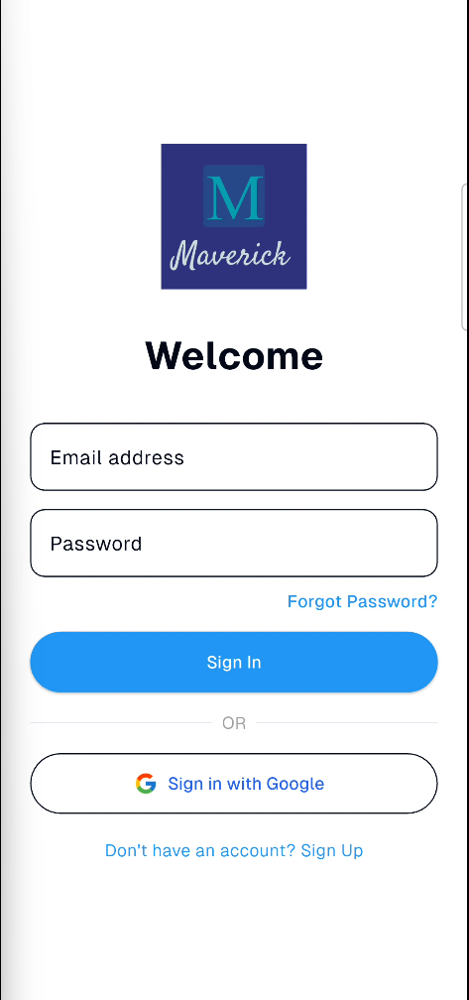

# Maverick

A modern learning platform for students, built with Flutter and designed with a beautiful dark theme.

## Vision

Maverick aims to empower learners by providing access to a wide range of tech courses and programs in an engaging, intuitive, and mobile-first experience. The platform is designed to help users discover, enroll in, and track progress across diverse learning opportunities in software engineering, cloud computing, cybersecurity, and more.

## Objectives

- Deliver a seamless and beautiful learning experience on mobile and web using Flutter.
- Enable users to browse, enroll in, and complete courses and programs.
- Provide personalized recommendations and progress tracking.
- Ensure easy navigation with a modern, dark-themed user interface.
- Offer rich, formatted content with syntax-highlighted code examples.

## Available Programs

Maverick currently offers **6 comprehensive tech programs**, each structured with multiple modules and lessons:

1. **AI Engineer Pathway** - Master artificial intelligence and machine learning
2. **Cloud Architect Program** - Learn cloud infrastructure and architecture
3. **Cyber Sentinel** - Dive into cybersecurity and ethical hacking
4. **Data Driver** - Become proficient in data science and analytics
5. **DevOps Pipeline** - Master DevOps practices and automation
6. **Fullstack Accelerator** - Build complete web applications from front to back

All programs are stored as JSON files in `assets/programs/data/` and contain rich markdown content with code examples, making them easy to update and maintain.

## Content Structure

### JSON-Based Course Data
Each program is defined in a JSON file containing:
- Program metadata (title, description, duration, difficulty level)
- Module structure with lessons and topics
- Markdown-formatted content for each module
- Code examples in Python, JavaScript, and other languages

### Markdown Content Rendering
Course content is beautifully rendered using `flutter_markdown` with:
- **GitHub-style code blocks** with syntax highlighting for Python and JavaScript
- **Automatic language detection** for code snippets
- **Professional typography** using Google Fonts:
  - **Poppins** for headings - modern and bold
  - **Inter** for body text - optimized for readability
  - **JetBrains Mono** for code - developer-focused monospace
- Proper spacing, line heights, and letter spacing for optimal readability

### Code Block Features
- Syntax highlighting with GitHub's color scheme (dark theme)
- Language labels on code blocks
- Horizontal scrolling for long code lines
- Bordered containers with rounded corners
- Theme-aware styling that adapts to dark mode

## Design & Theme

### Dark Theme
Maverick features a **modern dark theme** throughout the entire application:
- Easy on the eyes for extended learning sessions
- Professional appearance with carefully chosen color schemes
- High contrast ratios for excellent readability
- Consistent styling across all screens and components

### Modern Typography
The app uses premium Google Fonts for a polished, professional look:
- Large, bold headings (Poppins) for clear section hierarchy
- Readable body text (Inter) with generous line spacing
- Monospace code font (JetBrains Mono) for technical examples
- Optimized font sizes and weights for mobile and web platforms

## Navigation Flow

Maverick features a simple, intuitive navigation structure with five main screens:

1. **Login Screen**
   - The entry point for all users with a simple authentication system.
   - Users can sign in with any email and password, as long as the email is valid (contains `@` and `.com`).
   - After successful login, users are redirected to the Home screen.

2. **Home Screen**
   - Displays a list of new and recommended courses.
   - Shows the user's current progress in enrolled courses.
   - Features a bottom navigation bar for quick access to other sections.

3. **Programs Screen**
   - Accessed via the bottom navigation bar.
   - Lists all available programs with brief details for each.
   - Users can browse and select programs to learn more.

4. **Program Detail Screen**
   - Shows comprehensive details about a selected program.
   - Allows users to enroll in the program.
   - Displays the full list of course contents within the program.

5. **Profile Screen**
   - Accessed via the bottom navigation bar.
   - Displays user information and profile details.

## Bottom Navigation Bar

The bottom navigation bar is visible on main screens and includes:
- **Home:** Returns to the Home screen.
- **Programs:** Opens the Programs listing page.
- **My Courses:** Shows the user's enrolled courses and progress.
- **Profile:** Opens the Profile screen.

## Screenshots

Below are screenshots of Maverick in action:

<table>
  <tr>
    <td></td>
    <td></td>
    <td></td>
  </tr>
  <tr>
    <td></td>
    <td></td>
    <td></td>
  </tr>
</table>

## Screen Recording

https://github.com/Esfokom/Maverick/raw/main/public/screenrecordings/Maverick.mp4

  
Click to view embedded video

  <video src="public/screenrecordings/Maverick.mp4" controls width="600"></video>

## Summary

Maverick is a comprehensive learning platform built with Flutter that offers 6 complete tech programs with rich, interactive content. The app features a modern dark theme throughout, beautiful typography using Google Fonts (Poppins, Inter, and JetBrains Mono), and GitHub-style code blocks with syntax highlighting for Python and JavaScript. All course content is stored as JSON files with markdown formatting, making it easy to maintain and update. With simple authentication and an intuitive interface, learners can discover, enroll in, and track progress across diverse programs in AI, cloud computing, cybersecurity, data science, DevOps, and fullstack development.
